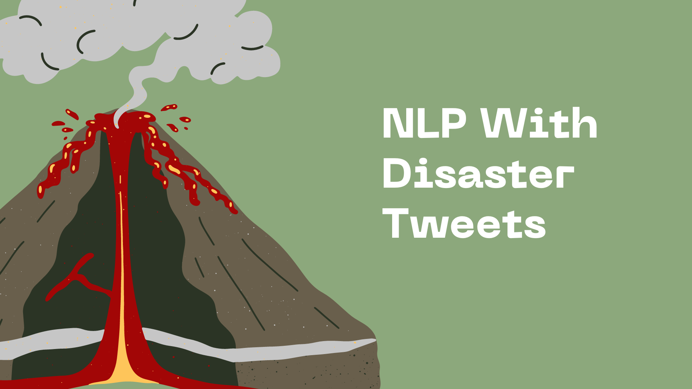
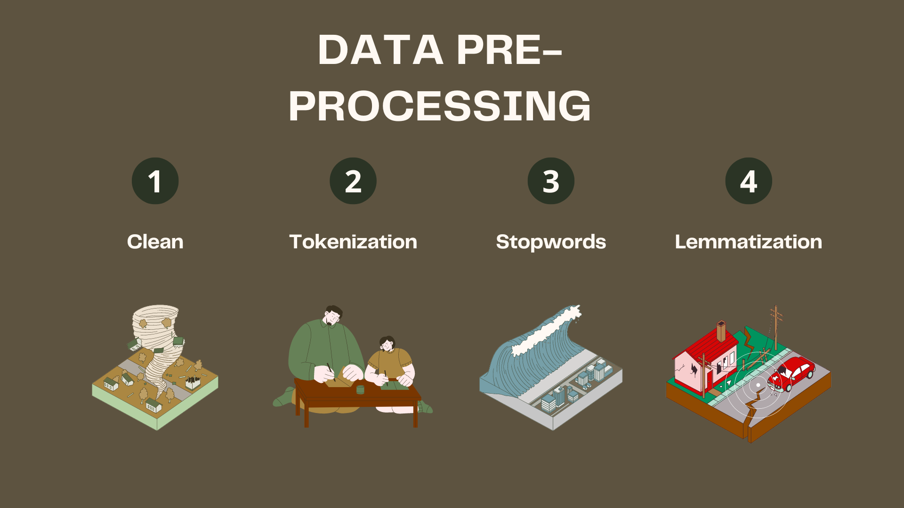
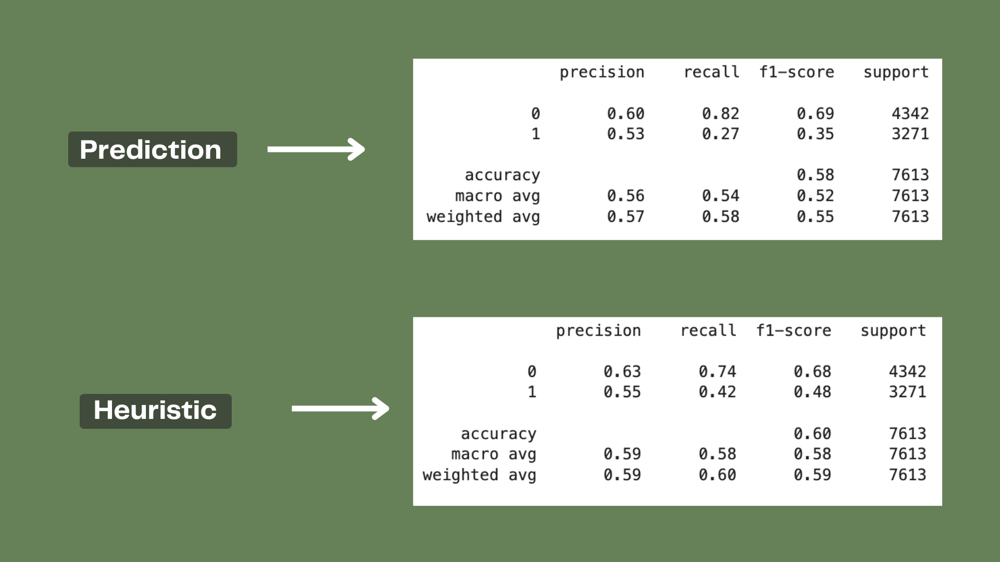
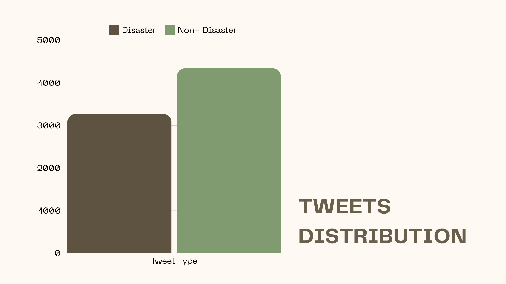
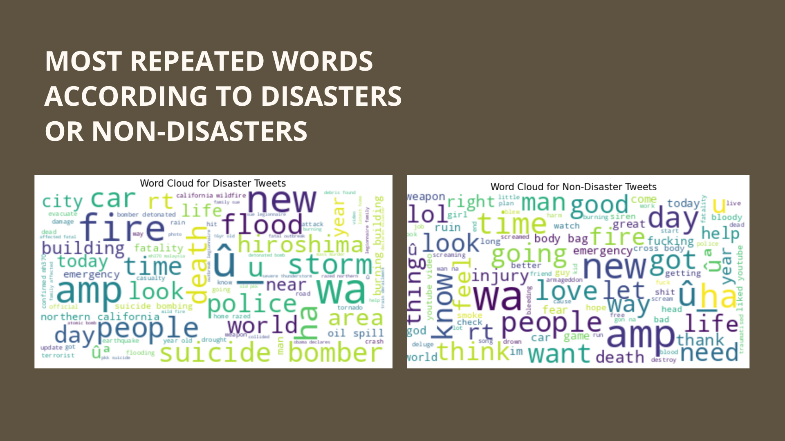
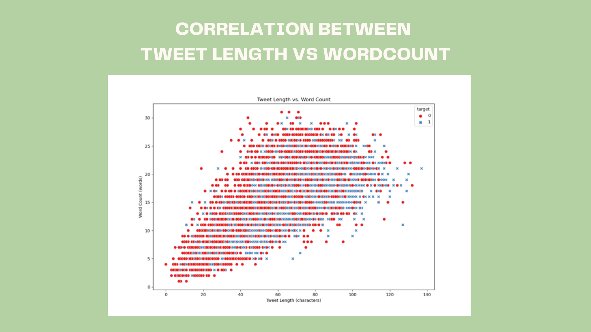
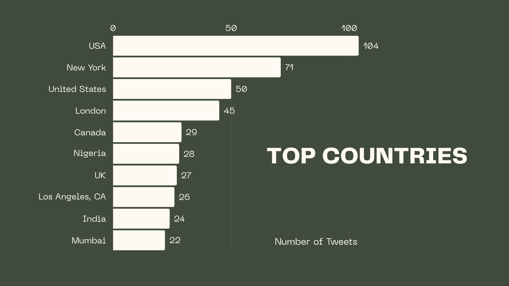

## # NLP TwiSOS: Natural Language Processing for Twitter Sentiment Analysis

### Objective: Analyzed tweets about emergency disasters using NLP techniques to improve crisis management

## Contents
- `dataset`: obtained from a Kaggle data set: [LINK](https://www.kaggle.com/competitions/nlp-getting-started)
- `notebook`: Jupyter Notebooks for data preprocessing, model training, and evaluation.

## Objectives
- Perform sentiment analysis on tweets related to emergency situations.
- Develop machine learning models to classify tweets into positive, negative, or neutral sentiments.
- Provide insights into public sentiment during emergency events for disaster response teams and researchers.

### WHAT IT IS NLP?

NLP is a branch of machine learning that uses algorithms and techniques for computers to effectively understand, interpret and generate human language. 
The central idea is that NLP deals with processing human language while discovering patterns, relationships, and semantics present in large amounts of data.

For this NLP project, the most important thing is that the text column that we want to analyze and which corresponds to a kind of target column, must be clean following a series of steps:
- Data Preprocessing
- Feature Engineering

### 1. Data Preprocessing

Data preprocessing consists of taking the column that we want to analyze, in this case, it corresponds to the text column containing Disaster Tweets. 
Once we were left with only the column we wanted to analyze we performed a series of steps that helped us prepare the data as needed to perform an NLP.

There are a lot of steps that you can follow for data preprocessing in NLP models, but you have to choose only those you need depending on your analysis.

We used:

**1. Lowercasing:** Convert all text to lowercase to standardize it.

**2. Removing URLs:** Eliminate any web links as they are usually not informative for text classification.

**3. Removing special characters and numbers:** These are typically not useful for understanding the sentiment or topic of the text.

**4. Word Tokenization:** Split text into individual words or tokens.

**5. Removing stopwords:** Stopwords are common words (such as "the", "a", etc.) that may not be useful in some types of text analysis.

**6. Lemmatization:** Reduce words to their base or root form.

We applied these preprocessing steps to the 'text' column of our training data.

## Key concepts for NLP analysis: 

**Tokenization:** 
Is the process of dividing a text into smaller units, called “tokens”. These tokens can be words, phrases, or even individual characters. It is used to convert text into a structure that can be easily read by a machine.

When you tokenize, you can choose between **sentence tokenization** or **word tokenization**: 

 - **Sentence Tokenization:** the text is broken down into sentences and that is further broken down into words. The input is given as text or a corpus. The output generates a list of sentences. For example, in the text, `"I love dogs. I have a dog"`, the output is ["I love dogs,” “I have a dog”]

 - **Word Tokenization:** is the same as sentence tokenization. It is used on words so that individual words are separated as items in a list. For example, in the sentence, "Chennai is humid," the result is ["Chennai,” “is,” “humid”].

**Stopword Removal:** is a process that removes common and irrelevant words from a text before analysis. Irrelevant words, also known as stopwords, are words that don’t contribute much meaning to the text and can make analysis difficult. Some common examples of irrelevant words are like ‘after,’ ‘every,’ and ‘I’.

**Lemmatization or Stemming:**

 - **Stemming:** Stemming applies algorithmic rules to simply extract the root of the derived word. The words produced by this step have no essential meaning, but are simply a bunch of letters put together without affixes. By reducing words to their roots, we can reduce the number of unique words we must process.

 - **Lemmatization:** is similar to stemming but it adds context to bring out the true meaning. It uses a dictionary and morphological analysis to identify the actual root word (lemma) considering context. The lemma is a real word that captures the core meaning ("beauty" for "beautiful").

In this analysis, we only use Lemmatization because we consider that in order to analyze disaster tweets it is necessary to take into account the context of the word and not only its root.

### 2. Feature Engineering

Is about preparing the data in a way that is most suitable for machine learning algorithms to process and learn from. This involves understanding the data, identifying the relevant features, and transforming them into a format that the model can understand.

**Word Embedding:** is the process of converting text into numerical data. It is a fundamental technique for converting individual words into numerical vectors that capture their meaning and relationships to other words. This allows machine learning models to process and understand natural language more effectively.

This step is important because it allows machine learning models to work with text efficiently.

**Sentiment Analysis:** is a powerful tool used to understand the emotional tone behind a piece of text. It is used to know whether the person is talking about something in a positive way or a negative way. It can be classified broadly into positive, negative, and neutral.

### Classification Report

To interpret these metrics, consider the following:

- **High precision:** A high precision value indicates that the model is good at identifying positive cases and that most of its positive predictions are correct.
- **High recall:** A high recall value indicates that the model is good at capturing all of the actual positive cases and that it is not missing many positive examples.
- **High F1-score:** A high F1-score indicates that the model is performing well overall, balancing both precision and recall.
- **Balanced support:** Having similar support values for both classes suggests that the model is not biased towards one class or the other.

**Prediction test:** 

Refers to the evaluation of the performance of a predictive model when applying this model to data that it has not seen before. The purpose is to measure how well the model can generalize and make accurate predictions on new data, not present during training.

**Heuristic test:** 

In the context of natural language processing (NLP), testing a model with a different heuristic and then retesting the model can have several implications:

**Evaluating the effectiveness of the new heuristic:** By comparing the performance of the model before and after applying the new heuristic, you can evaluate if the heuristic has improved the model's performance. If the model performs better with the new heuristic, it suggests that the heuristic is effective in improving the model's ability to process and understand natural language.

**Identifying potential biases or limitations of the heuristics:** Retesting the model with different heuristics can help uncover potential biases or limitations of the heuristics themselves.

## **Visualizations:**

